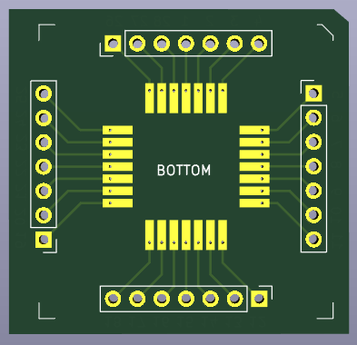
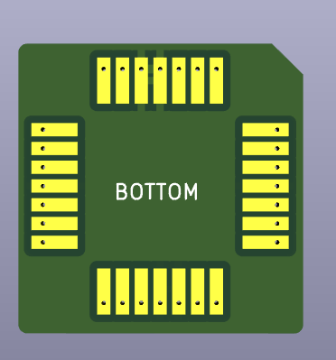

# GAL toys

This repostitory contains some random GAL toys.

## GALex

Mount a socket on top and a PLCC plug on the bottom, or just a socket on the
bottom. This board exposes all GAL signals on pin headers surrounding the chip.

## GALpowerup

GAL interposer that connects pin 1 to VCC and 8, 15 and 22 to GND. Mount a
socket on top and a PLCC plug on the bottom.

